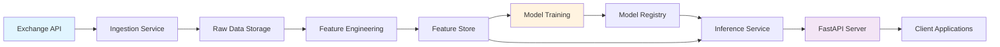

# Architecture Overview

## System Design

The Bitcoin On-Chain Predictive Framework is built on a modular architecture that separates concerns across data ingestion, feature engineering, model training, and inference serving.

## High-Level Architecture

```
┌─────────────────────────────────────────────────────────────────┐
│                     Bitcoin On-Chain Framework                   │
└─────────────────────────────────────────────────────────────────┘
                              │
        ┌─────────────────────┼─────────────────────┐
        │                     │                     │
        ▼                     ▼                     ▼
┌──────────────┐      ┌──────────────┐     ┌──────────────┐
│   Ingestion  │      │   Training   │     │  Inference   │
│   Pipeline   │      │   Pipeline   │     │   Service    │
└──────────────┘      └──────────────┘     └──────────────┘
        │                     │                     │
        ▼                     ▼                     ▼
┌──────────────┐      ┌──────────────┐     ┌──────────────┐
│   Raw Data   │─────▶│   Features   │────▶│   Models     │
│  (Exchange)  │      │  (Engineered)│     │  (XGBoost)   │
└──────────────┘      └──────────────┘     └──────────────┘
                                                    │
                                                    ▼
                                            ┌──────────────┐
                                            │  FastAPI     │
                                            │   Server     │
                                            └──────────────┘
```

## Component Details

### 1. Data Ingestion (`src/ingestion.py`)

**Purpose:** Fetch historical and real-time OHLCV (Open, High, Low, Close, Volume) data from cryptocurrency exchanges.

**Key Features:**
- Uses `ccxt` library for unified exchange API access
- Supports multiple exchanges (Binance, Kraken, Coinbase, etc.)
- Implements rate limiting and error handling
- Stores raw data in CSV format for reproducibility

**Data Flow:**
```
Exchange API → CCXT Client → Pandas DataFrame → CSV Storage
```

### 2. Feature Engineering (`src/features.py`)

**Purpose:** Transform raw OHLCV data into predictive features using technical indicators and statistical methods.

**Generated Features:**
- **Price Features:** Returns, log returns, price momentum
- **Volatility:** Rolling standard deviation, ATR (Average True Range)
- **Technical Indicators:**
  - Moving Averages (SMA, EMA)
  - RSI (Relative Strength Index)
  - MACD (Moving Average Convergence Divergence)
  - Bollinger Bands
  - Volume indicators (OBV, VWAP)
- **Temporal Features:** Hour of day, day of week, month
- **Target Variables:** Future price changes at 30min, 60min, 180min horizons

**Feature Matrix:**
```
Input: OHLCV data (T rows × 6 columns)
Output: Feature matrix (T rows × ~50 columns)
```

### 3. Model Training (`src/train.py`)

**Purpose:** Train XGBoost regression models for multi-horizon price prediction.

**Model Architecture:**
- **Algorithm:** XGBoost Regressor
- **Objective:** Regression (predicting percentage price change)
- **Loss Function:** Mean Squared Error (MSE)
- **Validation:** Time-based train/test split (no shuffling)
- **Early Stopping:** Monitors validation loss to prevent overfitting

**Hyperparameters:**
```yaml
n_estimators: 500
max_depth: 7
learning_rate: 0.05
subsample: 0.8
colsample_bytree: 0.8
min_child_weight: 3
gamma: 0.1
reg_alpha: 0.1 (L1 regularization)
reg_lambda: 1.0 (L2 regularization)
```

**Training Process:**
1. Load processed features
2. Split data (80% train, 20% test)
3. Train separate models for each horizon
4. Evaluate on test set
5. Save models and metrics

### 4. Inference Service (`src/inference.py`)

**Purpose:** Load trained models and make predictions on new data.

**Workflow:**
1. Fetch latest market data
2. Apply feature engineering
3. Load trained models
4. Generate predictions for all horizons
5. Return formatted results

**Prediction Output:**
```python
{
  "timestamp": "2024-02-15T18:00:00Z",
  "current_price": 52000.00,
  "predictions": {
    "30min": {"price": 52100, "change_pct": 0.19},
    "60min": {"price": 52300, "change_pct": 0.58},
    "180min": {"price": 52800, "change_pct": 1.54}
  }
}
```

### 5. API Layer (`api/main.py`)

**Purpose:** Serve predictions via RESTful API using FastAPI.

**Endpoints:**
- `GET /` - Health check
- `GET /predict` - Get current predictions
- `GET /backtest` - Run historical backtests
- `POST /retrain` - Trigger model retraining (admin)

**API Architecture:**
```
FastAPI Application
├── Routers
│   ├── /predict (prediction_service)
│   └── /health (monitoring_service)
├── Services
│   ├── PredictionService
│   └── MonitoringService
└── Models (Pydantic schemas)
```

## Data Flow Diagram



## Deployment Architecture

### Local Development
```
Developer Machine
├── Python Virtual Environment
├── Local SQLite (optional)
└── Jupyter Notebooks (research)
```

### Production (Recommended)
```
┌─────────────────────────────────────────┐
│           Docker Container               │
│  ┌────────────────────────────────┐    │
│  │    FastAPI Application         │    │
│  │    (uvicorn workers)           │    │
│  └────────────────────────────────┘    │
│                                         │
│  ┌────────────────────────────────┐    │
│  │    Scheduled Jobs              │    │
│  │    - Data ingestion (cron)     │    │
│  │    - Model retraining (weekly) │    │
│  └────────────────────────────────┘    │
└─────────────────────────────────────────┘
```

## Model Lifecycle

```
1. Data Collection (Hourly)
   ↓
2. Feature Engineering (On-demand)
   ↓
3. Model Training (Weekly)
   ↓
4. Model Evaluation
   ↓
5. Model Deployment
   ↓
6. Prediction Serving (Real-time)
   ↓
7. Performance Monitoring
   ↓
8. Retraining Trigger (if drift detected)
```

## Technology Stack Rationale

| Component | Technology | Rationale |
|-----------|-----------|-----------|
| **Language** | Python 3.9+ | ML ecosystem, library support |
| **ML Library** | XGBoost | Fast, accurate for tabular data |
| **Data Processing** | Pandas/NumPy | Standard for data manipulation |
| **API Framework** | FastAPI | Async support, auto-documentation |
| **Data Source** | CCXT | Unified exchange API interface |
| **Indicators** | TA-Lib | Industry-standard technical analysis |
| **Testing** | Pytest | Comprehensive testing framework |

## Security Considerations

- **API Keys:** Stored in `.env` files (never committed)
- **Input Validation:** Pydantic models validate all API inputs
- **Rate Limiting:** Prevents API abuse
- **CORS:** Configurable for production deployment

## Scalability Notes

**Current Limitations:**
- Single-threaded data ingestion
- In-memory model loading
- Local file storage

**Future Improvements:**
- Distributed training (Dask/Ray)
- Model serving with caching (Redis)
- Cloud storage (S3/GCS)
- Horizontal scaling with load balancer

## Monitoring & Observability

**Metrics Tracked:**
- Prediction accuracy (rolling window)
- API latency
- Model inference time
- Data freshness

**Logging:**
- Structured logging with `loguru`
- Log levels: DEBUG, INFO, WARNING, ERROR
- Rotation: Daily, 7-day retention

## Conclusion

This architecture provides a solid foundation for a production-grade ML system while maintaining simplicity for research and development. The modular design allows for easy extension and customization based on specific use cases.
