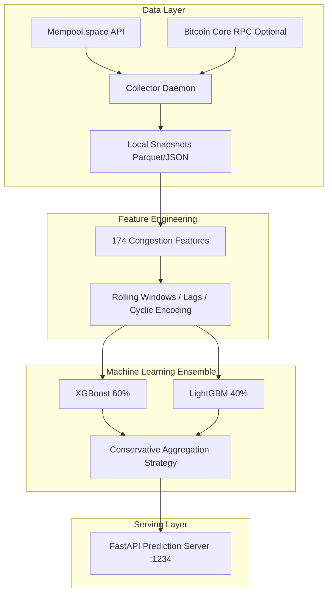

# Bitcoin Mempool Fee Predictor

**Intelligent forecasting of Bitcoin transaction fee economics.**

Este sistema reemplaza la predicción tradicional del precio del mercado de Bitcoin para enfocarse exclusivamente en la **economía on-chain**: prediciendo comisiones requeridas (`sats/vByte`) para inclusión de transacciones en los próximos bloques usando métricas profundas de estado de la Mempool.

## 🎯 Objetivo General
Proveer una inferencia de comisiones ágil, robusta y con garantías computacionales altas (90%+ Block Inclusion Accuracy) asistiéndote en el pago del _fee exacto_, previniendo "sobrepagos" por subidas súbitas del mercado y "pagos insuficientes" (transacciones atascadas en la red). 

## 🏗️ Arquitectura de Software

El sistema es un pipeline integral **MLOps**, diseñado para recolectar datos 24/7 y mejorar a través de re-entrenamientos autónomos. 



### Componentes Core:
1. **Collector (`scripts/collector_daemon.py`)**: Tarea de recolección continua perpetua. Cada 2 minutos captura todo el estado de la red (hashrate, congestión, mempool bytes, proyecciones goteadas de mempool.space).
2. **Feature Engineer (`src/features.py`)**: Transformación brutal de la información estática hacia 174 características de dinámica topológica (gradientes, factores de urgencia, divergencias de Hashrate y promedios móviles exponenciales).
3. **Auto-Retrain (`scripts/auto_retrain.py`)**: Ejecutado via cron o GitHub Actions, un flujo robusto que auto-lee la base de datos acumulada, construye target variables (`block_inclusion` a futuro 1, 3, y 6 bloques) y retro-alimenta los tensores.
4. **Prediction API (`api/main.py`)**: Una interfaz de puerto de acceso (`:1234`) para integrar en aplicaciones Frontend o Billeteras mediante peticiones HTTP.

## 🛠️ Tecnologías Clave
- **Python 3.11+**, `FastAPI`, `pandas`, `uvicorn`
- **Machine Learning Ensemble**: `xgboost`, `lightgbm`, `scikit-learn`
- **Daemons**: Procesos resilientes usando `systemd` para alta disponibilidad en Linux.

## 📊 Integración e Inferencia (API)

Con el servicio activo, puedes obtener en tiempo real los pronósticos contactando al endpoint local expuesto en el puerto 1234:

```bash
# Predicciones exactas de Mempool
curl http://localhost:1234/fees/predict
```

**Respuesta Típica:**
```json
{
  "fee_predictions": {
    "1_block": {
      "predicted_fee_sat_vb": 7,
      "confidence_interval": [6, 8],
      "priority": "high",
      ...
    },
    "3_block": { ... },
    "6_block": { ... }
  },
  "recommendation": "LOW",
  ...
}
```

## 🔄 Despliegue en Producción (Systemctl)
Si estás corriendo Linux, el framework te permite anclar el flujo a tu namespace local:
```bash
# Iniciar servicios:
systemctl --user enable --now mempool-collector.service mempool-api.service

# Revisar estatus:
systemctl --user status mempool-collector.service mempool-api.service

# Ver Logs del servicio de IA:
journalctl --user -u mempool-api.service -f
```

---
*Hecho por CUBOPLUS-BTC*
