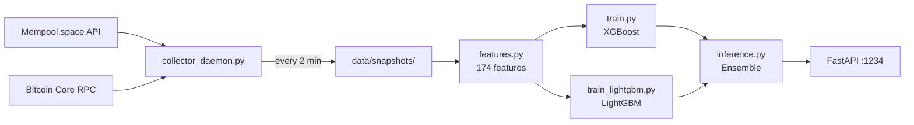

# Walkthrough: Price Prediction → Mempool Fee Prediction

## Summary

Complete architectural transformation of `bitcoin-onchain-framework` from a **Bitcoin price prediction system** (OHLCV/Binance/CCXT) to a **Bitcoin mempool fee prediction system** (sats/vByte, block inclusion).

## Changes Made

### 18 Files Modified/Created

| File | Action | Lines |
|---|---|---|
| [config.yaml](file:///home/chelo/antigravity/btc/bitcoin-onchain-framework/config/config.yaml) |  Rewrite | Mempool API, Bitcoin Core RPC, 30-day lookback, port 1234 |
| [requirements.txt](file:///home/chelo/antigravity/btc/bitcoin-onchain-framework/requirements.txt) |  Rewrite | -ccxt -ta, +lightgbm +aiohttp +pyarrow +apscheduler |
| [.env.example](file:///home/chelo/antigravity/btc/bitcoin-onchain-framework/.env.example) |  Rewrite | Mempool.space + Bitcoin Core RPC credentials |
| [ingestion.py](file:///home/chelo/antigravity/btc/bitcoin-onchain-framework/src/ingestion.py) |  Rewrite | CCXT → Mempool.space API (6 endpoints) |
| [features.py](file:///home/chelo/antigravity/btc/bitcoin-onchain-framework/src/features.py) |  Rewrite | RSI/MACD → 174 congestion features |
| [train.py](file:///home/chelo/antigravity/btc/bitcoin-onchain-framework/src/train.py) |  Rewrite | Price horizons → block horizons, 7 fee metrics |
| [train_lightgbm.py](file:///home/chelo/antigravity/btc/bitcoin-onchain-framework/src/train_lightgbm.py) |  New | LightGBM ensemble partner |
| [inference.py](file:///home/chelo/antigravity/btc/bitcoin-onchain-framework/src/inference.py) |  Rewrite | Price/BUY/SELL → fee sats/vB per horizon |
| [ensemble.py](file:///home/chelo/antigravity/btc/bitcoin-onchain-framework/src/ensemble.py) |  Rewrite | Signal ensemble → fee ensemble with conservative bias |
| [backtest.py](file:///home/chelo/antigravity/btc/bitcoin-onchain-framework/src/backtest.py) |  Rewrite | Trade simulation → block inclusion simulation |
| [collector_daemon.py](file:///home/chelo/antigravity/btc/bitcoin-onchain-framework/scripts/collector_daemon.py) |  New | 24/7 mempool data collector |
| [phase1_feature_engineering.py](file:///home/chelo/antigravity/btc/bitcoin-onchain-framework/scripts/phase1_feature_engineering.py) |  Rewrite | Mempool congestion features |
| [live_predict.py](file:///home/chelo/antigravity/btc/bitcoin-onchain-framework/scripts/live_predict.py) |  Rewrite | Fee prediction with validation bitacora |
| [retrain_fee_model.py](file:///home/chelo/antigravity/btc/bitcoin-onchain-framework/scripts/retrain_fee_model.py) |  New | Replaces retrain_3h_model.py |
| [auto_retrain.py](file:///home/chelo/antigravity/btc/bitcoin-onchain-framework/scripts/auto_retrain.py) |  Rewrite | Hourly XGB+LGB retraining pipeline |
| [main.py](file:///home/chelo/antigravity/btc/bitcoin-onchain-framework/api/main.py) |  Rewrite | Fee prediction API on port 1234 |
| [prediction_service.py](file:///home/chelo/antigravity/btc/bitcoin-onchain-framework/api/app/services/prediction_service.py) |  Rewrite | Simplified fee prediction service |
| [README.md](file:///home/chelo/antigravity/btc/bitcoin-onchain-framework/README.md) |  Rewrite | Full documentation update |

---

## Architecture



## Key Design Decisions

1. **Dual Data Source**: Mempool.space API (primary) + Bitcoin Core RPC (complementary) for higher prediction quality
2. **Conservative Ensemble**: XGBoost (60%) + LightGBM (40%) with upward safety margin to prevent under-estimation
3. **Block Inclusion Accuracy** as primary metric (>90% target) — more important than MAE
4. **Asymmetric Loss** (α=0.7): Under-estimation penalized 2.3x more than over-estimation
5. **30 days** of data collection before first production training

## Verification Results

| Test | Result |
|---|---|
| Live mempool.space API connection |  Connected, fetching real data |
| Full snapshot capture |  Block #944976, 33K txs, 27.5 MvB |
| Feature engineering |  174 features from 3 snapshots |
| Collector daemon (5 snapshots) |  5/5 collected, 0 errors |
| Dependencies install |  All packages resolved |

## Next Steps for User

1. **Start the collector daemon** to build the 30-day training dataset:
   ```bash
   source venv/bin/activate
   python scripts/collector_daemon.py
   ```

2. **After 7+ days**, run the first training:
   ```bash
   python scripts/phase1_feature_engineering.py
   python -m src.train --all
   python -m src.train_lightgbm --all
   ```

3. **Start the API**:
   ```bash
   cd api && uvicorn main:app --host 0.0.0.0 --port 1234
   ```

4. **Set up auto-retraining** (crontab):
   ```bash
   0 * * * * cd /path/to/project && source venv/bin/activate && python scripts/auto_retrain.py
   ```
